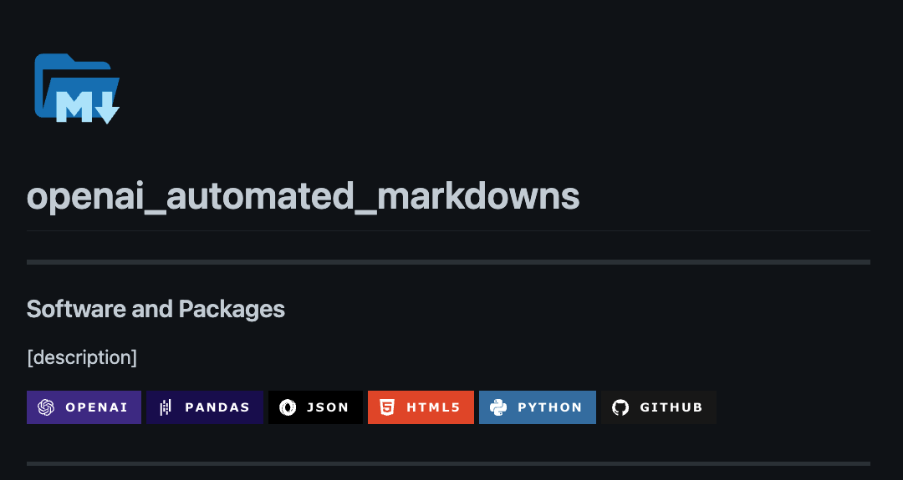
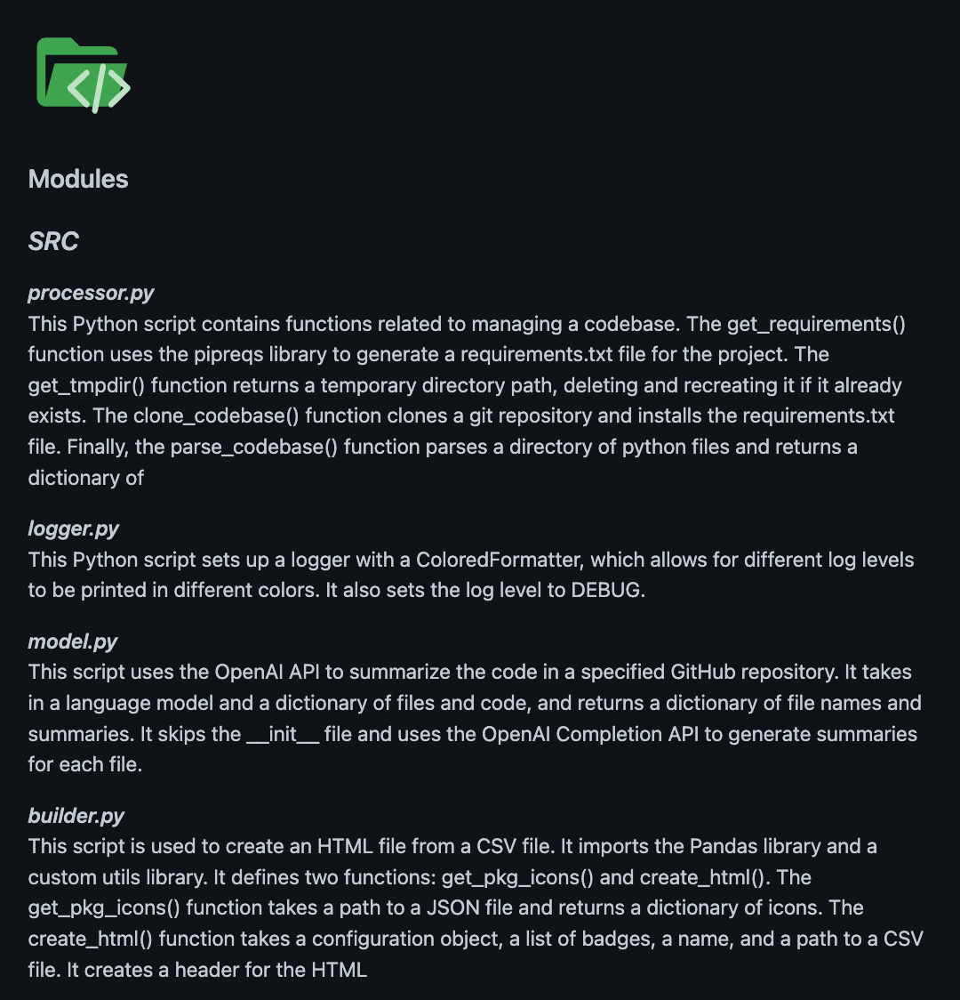

<a style="vertical-align:middle">

<span style="vertical-align:middle">
<h1>OpenAI Automated Markdown Doc</h1></span></a>

This project generates a structured Markdown template to kickstart your machine learning projects. Leverages OpenAI API models to convert Python code to natural language, providing boilerplate summaries for our codebase.

> Note: automated templates will always have a very opinionated setup that you should update and adapt for your own needs, but it might be a good starting point for your project.

---
## Software and Packages


---

## Overview

The code usese the base GPT Davinci model to translate a given repository of Python code to documentaion, aiming to generate boilerplate Markdown docs for my projects. Features include:

1. Automated header badge icons related to your project dependencies.
2. Generates summaries of each `.py` file from the input GitHub repository.
3. Creates a structured output Markdown template containing the project documentation.
4. Generates repository file tree.
5. [Automated docstrings](https://github.com/cdesarmeaux/autodocstrings) - ```bash scripts/auto_docstrs.sh```

The images below contain sample outputs of what the project generates so far.

> Document header with codebase package badges.



> Document header with codebase package badges.



## Prerequisites
### 🤖 OpenAI API
1. [OpenAI](https://beta.openai.com/docs/introduction) - generate API key on OpenAI's website.

---
## Usage

```Bash
# 1. Clone GitHub repository.
git clone https://github.com/king-technologies/Project-Initiator.git && cd gpt_auto_markdown_docs

# 2. Setup conda virtual environment.
make conda

# 3. Run the model.
bash scripts/run_model.sh
```

<a style="vertical-align:middle">

<span style="vertical-align:middle">
<h2>Repository</h2></span></a>

```shell
.
├── Makefile
├── README.md
├── conf
│   ├── __init__.py
│   ├── config.yaml
│   ├── data
│   │   └── icons.json
│   ├── driver
│   │   └── openai.yaml
│   ├── html
│   │   └── tags.yaml
│   └── repository
│       ├── github.yaml
│       └── local.yaml
├── output
│   ├── html_docs.html
│   ├── output.md
│   ├── png
│   │   ├── body.png
│   │   └── header.png
│   ├── raw_docs.csv
│   └── tree.md
├── pyproject.toml
├── requirements.txt
├── scripts
│   ├── auto_docstrs.sh
│   └── run_main.sh
├── setup.py
└── src
    ├── __init__.py
    ├── builder.py
    ├── logger.py
    ├── main.py
    ├── model.py
    ├── processor.py
    └── utils.py
```
<body>
<a style="vertical-align:middle">

<span style="vertical-align:middle">
<h2>Modules (src)</h2></span></a>
<h3><i>SRC</i></h3>
<dl>
    <dt><b><i>processor.py</i></b></dt>
    <dd>This Python script contains functions to clone a codebase from a given URL, create a temporary directory, and parse the codebase into a dictionary. The clone_codebase() function clones the codebase from the given URL into the temporary directory created by the get_tmpdir() function. The parse_codebase() function then reads all the Python files in the codebase and stores them in a dictionary with the file path as the key and the file contents as the value.</dd>
</dl>

<dl>
    <dt><b><i>logger.py</i></b></dt>
    <dd>This Python script sets up a logger with a ColoredFormatter, which allows for different log levels to be printed in different colors. It also sets the log level to DEBUG, which will print all log messages.</dd>
</dl>

<dl>
    <dt><b><i>model.py</i></b></dt>
    <dd>This script uses the OpenAI API to generate a summary of a Python script. It takes in a dictionary of files and code as an argument and loops through each file and code. It then creates a prompt for the OpenAI API to generate a summary of the code. The script then stores the summary in a list and returns the list of summaries.</dd>
</dl>

<dl>
    <dt><b><i>builder.py</i></b></dt>
    <dd>This Python script imports the Pandas library and reads a CSV file. It then iterates through the rows of the CSV file and creates an HTML document with a description of each row. The HTML document includes a roadmap, licenses, overview, prerequisites, repository structure, and modules.</dd>
</dl>

<dl>
    <dt><b><i>main.py</i></b></dt>
    <dd>This Python script is used to document a codebase. It takes a URL as input, uses an engine to parse the codebase, and then creates a summary of the codebase in a CSV file. It also creates HTML and Markdown documents of the codebase.</dd>
</dl>
</body>

## Roadmap

- Add compatability for multiple file types.
- Implement data version control - dvc.

---
## Licenses, Copyrights & Trademarks

- [GitHub Profile Badges - Aveek-Saha/GitHub-Profile-Badges](https://github.com/Aveek-Saha/GitHub-Profile-Badges)
- [Automated Docstrings - cdesarmeaux/autodocstrings](https://github.com/cdesarmeaux/autodocstrings)

---
